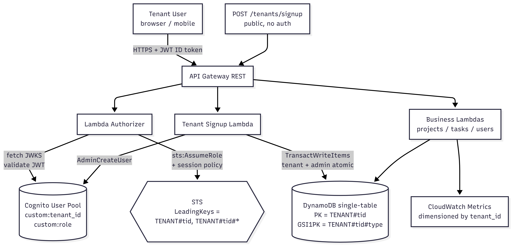

# Multi-Tenant SaaS Starter on AWS (Pool Model)

A copy-paste-ready prompt for AI coding agents (Claude Code, Cursor, Kiro) that generates a production-grade multi-tenant SaaS backend on AWS — with **two-layer tenant isolation** (Lambda authorizer + STS session policies), single-table DynamoDB partitioning, Cognito user pools, per-tenant cost attribution, and OIDC-based CI/CD — from a single prompt.

> **Submitted to the [AWS Prompt the Planet Challenge](https://dorahacks.io/) (DoraHacks × AWS Startups).**

---

## The problem

Every B2B startup that builds a multi-tenant SaaS rewrites the same broken isolation code on day one: a single missing `WHERE tenant_id = ?` clause leaks tenant A's data to tenant B, IAM policies broad enough that one buggy Lambda exposes every customer, Cognito user pools structured so badly that onboarding a new tenant requires manual ops, and per-tenant cost so opaque the company can't price its own product.

The "correct" architecture — pool model with defense-in-depth tenant isolation — is well-known to senior engineers but rarely written down in deployable form. This prompt closes that gap. Hand it to any modern AI coding agent and you get a complete, Well-Architected multi-tenant backend that a senior infrastructure engineer would approve in code review.

---

## What the prompt generates



```
Tenant user (browser / mobile)
   │  HTTPS + JWT (Cognito ID token with custom:tenant_id + custom:role)
   ▼
API Gateway (REST, optional custom domain + WAF)
   │
   ▼
Lambda Authorizer  ──►  validates JWT, calls sts:AssumeRole with inline
   │                    session policy: dynamodb:LeadingKeys StringLike
   │                    ["TENANT#{tenant_id}", "TENANT#{tenant_id}#*"]
   ▼
Business Logic Lambdas  ──►  receive tenant_id + role + scoped AWS credentials
   │                          via API Gateway authorizer context
   │
   ├──►  DynamoDB single-table (PK=TENANT#{tenant_id}, SK=ENTITY#...)
   │       with GSI for in-tenant cross-entity queries
   │
   └──►  CloudWatch custom metrics (per-tenant: API calls, DDB R/W, errors)

Cognito User Pool (one pool, custom:tenant_id + custom:role attributes)
   │
   └──►  Tenant signup creates tenant record + admin user atomically
         via DynamoDB TransactWriteItems
```

A complete Terraform + Python project, deployable with `make apply`:

- **Modular Terraform** (`modules/api`, `cognito`, `authorizer`, `business`, `data`, `tenant_signup`, `observability`) with `envs/dev` and `envs/prod`
- **Python 3.12 Lambdas** with `aws-lambda-powertools` for structured JSON logging (auto-injecting `tenant_id`), X-Ray tracing with per-tenant annotation, and custom metrics
- **Lambda authorizer** that validates Cognito JWTs against JWKS, then mints per-request STS credentials with a tenant-scoped session policy
- **Single-table DynamoDB** with `PK = TENANT#{tenant_id}` and GSI1 for entity-typed queries
- **Per-tenant CloudWatch dashboard** with widgets dimensioned by `tenant_id`, including a top-N tenants table
- **GitHub Actions CI/CD via OIDC** — no long-lived AWS access keys
- **Remote state bootstrap** — one-time `bootstrap/` directory that creates the S3 backend bucket and DynamoDB lock table

---

## Two-layer tenant isolation (the unique part)

Every multi-tenant pool-model design has *some* tenant isolation. Most have only one layer. This prompt enforces two:

**Layer 1 — Application code.** Business Lambdas read `tenant_id` from `event["requestContext"]["authorizer"]["tenant_id"]` (set by the authorizer from the validated JWT) and prefix every DynamoDB key with it. They **never** accept `tenant_id` from request body or path.

**Layer 2 — AWS API.** The Lambda authorizer calls `sts:AssumeRole` with an inline session policy: `dynamodb:LeadingKeys` constrained to `["TENANT#{tenant_id}", "TENANT#{tenant_id}#*"]` (two patterns — the bare form for base-table PK queries, the prefixed form for GSI partition keys). The business Lambda receives *those* credentials in its authorizer context and uses them — not its own role's. Even if app code has a bug and tries to read another tenant's partition, DynamoDB itself rejects the call with `AccessDeniedException`.

Either layer alone is a bug. Both layers together is defense-in-depth — and is what makes this prompt different from every other "multi-tenant SaaS starter" floating around.

A live cross-tenant probe (using one tenant's STS credentials to query another's partition) returns `AccessDeniedException` from DynamoDB itself — proof captured in [`screenshots/03-layer2-isolation-proof.png`](screenshots/).

---

## AWS services used

API Gateway (REST) · Lambda · Cognito User Pools · DynamoDB (on-demand, PITR) · STS (per-request session policies) · CloudWatch (Logs, Metrics, Dashboards, Alarms) · SNS · X-Ray · IAM · WAFv2 (optional, gated) · ACM (optional, with custom domain) · Route 53 (optional, with custom domain)

---

## AWS Well-Architected alignment

- **Security** — two-layer tenant isolation (Layer 1 app code, Layer 2 STS session policies with `dynamodb:LeadingKeys`); least-privilege IAM (one role per Lambda, scoped ARNs, no wildcards); JWT validation against Cognito JWKS with full claim checks (`iss`, `aud`, `exp`, `token_use`); Cognito advanced security in `ENFORCED` mode in prod; encryption at rest (DDB + Cognito KMS); TLS 1.2 everywhere.
- **Reliability** — `TransactWriteItems` for atomic tenant creation (tenant record + admin user succeed together or not at all); DynamoDB on-demand with PITR; idempotent signup via `idempotency_key` header; CloudWatch alarms on auth-failure spikes, business Lambda 5xx, DDB throttling, Cognito sign-in throttles.
- **Cost Optimization** — pool model amortises Cognito MAU + DDB cost across tenants; single-table design avoids per-tenant resource sprawl; WAF gated behind a Terraform variable; no NAT Gateway. **Under $10/month for 1,000 tenants × 100 MAU each at low-traffic baseline.**
- **Operational Excellence** — full IaC (Terraform 1.7+), CI/CD with `terraform fmt`, `validate`, `tflint`, `checkov`; per-tenant CloudWatch dashboard (top-N tenants by request count, by DDB consumption); X-Ray traces annotated with `tenant_id` (filter by tenant); structured JSON logs with `tenant_id` field for CloudWatch Logs Insights forensics.
- **Performance Efficiency** — async architecture (authorizer cached 5 min keyed on JWT); business Lambdas scale independently per route; Python 3.12 for fast cold starts; DynamoDB on-demand scales transparently.
- **Sustainability** — serverless throughout; no idle compute; on-demand billing aligns resource usage with actual demand.

---

## Prerequisites for using the prompt

- An AWS account (free tier sufficient for development)
- AWS CLI configured with credentials that can create IAM, Lambda, API Gateway, Cognito, DynamoDB, CloudWatch, and SNS resources
- Terraform 1.7+
- Python 3.12+
- `pip` 26.0+ (`python -m pip install --upgrade pip`) — older pip versions fail with `ResolutionImpossible` for `aws-lambda-powertools[tracer]` due to a PyPI Simple API incompatibility
- An AI coding agent: Claude Code, Cursor, or Kiro
- *(Optional)* A GitHub repository if you want OIDC-based CI/CD generated
- *(Optional)* A Route 53 public hosted zone if you want a custom domain on the API

---

## How to use

1. Open [`prompt.md`](prompt.md) and copy its entire contents.
2. Paste into your AI coding agent.
3. The agent will ask 7 questions (project name, environment, region, custom domain, entity types, GitHub repo, alert email). Answer each, or say *"use defaults"*.
4. The agent generates the complete project. The output structure is documented in the prompt itself.
5. Follow the generated `README.md` to run `make bootstrap`, then `make apply`.
6. Sign up your first tenant via `POST /tenants/signup`, get an ID token via `aws cognito-idp initiate-auth`, and hit the business endpoints.
7. Run the validation checklist at the bottom of `prompt.md` — including the explicit Layer 2 isolation probe.

---

## What an "example output" looks like

The [`example-output/`](example-output/) directory in this repo contains the actual code Claude Code generated when fed `prompt.md` with default inputs, deployed to a real AWS free-tier account, and validated end-to-end including a cross-tenant isolation probe. Use it to evaluate the prompt's quality before adopting it — **not** as a template to copy.

Deployment proof in [`screenshots/`](screenshots/):
- **CloudWatch dashboard** with per-tenant request count widget showing two real tenant IDs
- **X-Ray trace map** of an authorizer invocation (Client → Authorizer Lambda → Cognito JWKS + STS)
- **Layer 2 isolation proof** — terminal output of `dynamodb:Query` against tenant B's partition using tenant A's STS credentials, returning `AccessDeniedException`

---

## Troubleshooting

- **`401 Unauthorized` from the API** — check the authorizer Lambda's CloudWatch logs. Common causes: token expired (Cognito ID tokens last 60 min — re-run `initiate-auth`); `token_use` mismatch (the authorizer accepts `id` tokens by default, not `access` — use `IdToken` from `AuthenticationResult`); JWKS fetch failed (check Lambda has internet egress).
- **`403 Forbidden: operation rejected by tenant isolation policy`** — the business Lambda's DynamoDB call hit the session policy's `LeadingKeys` constraint. Verify the request is using the tenant's own credentials and the partition key matches `TENANT#<tenant_id>` or `TENANT#<tenant_id>#*`. If you added a new GSI, ensure its PK starts with `TENANT#<tenant_id>#`.
- **`AccessDenied ... sts:TagSession`** during `AssumeRole` — both the authorizer's inline policy AND the `TenantAccessRole` trust policy must permit `sts:TagSession` in addition to `sts:AssumeRole`. The prompt requires both; if you customised IAM, re-check.
- **Cognito pool creation fails with `AttributesRequireVerificationBeforeUpdate must exist in AutoVerifiedAttributes`** — remove the `user_attribute_update_settings` block. It conflicts with the conditional `auto_verified_attributes` when `auto_confirm_signups = true` in dev.
- **Lambda build fails with `ResolutionImpossible` for `aws-lambda-powertools`** — upgrade pip: `python -m pip install --upgrade pip`. Pip 25.x is incompatible with PyPI's Simple API.
- **`AttributeError: module 'jose.jwt' has no attribute 'jwk'`** in authorizer logs — use `from jose import jwk, jwt` and call `jwk.construct(key)`, not `jwt.jwk.construct(key)`.
- **High AWS cost concern** — WAF and custom domain are gated behind `enable_waf` and `enable_custom_domain` Terraform variables (default `false`). With both off, dev cost stays under $5/month. Cognito MAU is the largest line item at scale — note that pricing tiers down sharply above 100K MAU.

A full teardown procedure is included in the generated `example-output/README.md`.

---

## License

MIT — see [LICENSE](LICENSE).
